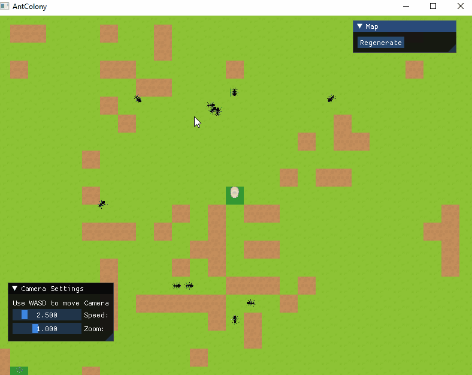
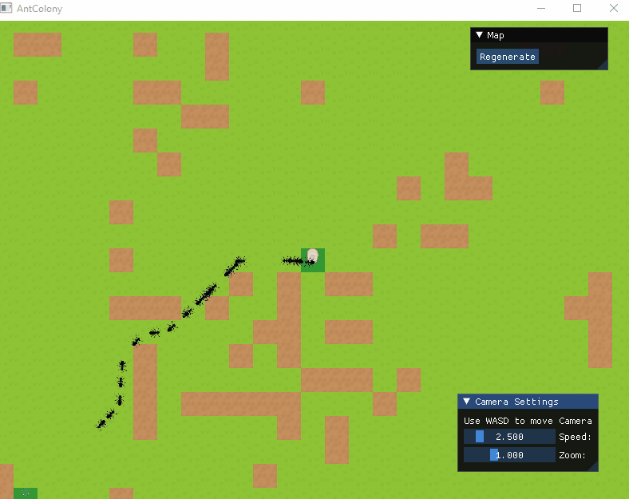

# AntColony

#Overview:
I wanted to do a project that I could complete in a few days. I remembered a mention of using "ant pheromones" to simulate resource harvesters in RTS games which I always thought was an interesting idea. The project has two parts what I have (rather grandly) called an engine and the game layer including the ant harvesters and a randomly generated map.

## 1. Engine

The "engine" is a fancy name for a wrapper around OpenGL with some additional helper functionality for core functionality delegates, file loading etc. Given that I wanted to complete the project in a few days some compromises clearly had to be made. For example I decided to not offer cross-platform support. Nevertheless I tried to code in a way that adding an additional layer of abstraction later should not be too difficult if needed later. Similarly I made no effort to make a separate render thread, I feel this would have been overkill for an extremely basic 2D tile grid anyway. I was confident that this would not cause GPU issues even with large numbers of tiles on screensince I have batch-rendered using a texture atlas such that there is only be one draw call (per transparency layer). 

## 2. Ant Colony Layer

This consists of two parts the generation of the world and the ant behaviour. 

### (i) World Generation:

The world generation uses cellular automata techniques. This is not something that I would likely use in a real project as I think it is quite difficult to control but it is an interesting idea that I wanted to try out. In cellular automata the gird updates in iteration according to a set of rules such as

| Source Tile | # Wall Neighbours | # Mud Neighbours | # Grass Neighbours | Result Tile |
|-------------|-------------------|------------------|--------------------|-------------|
| Grass       | 0                 | 5                | 3                  | Mud         |
| Mud         | 1                 | 4                | 3                  | Grass       |

Interesting patterns naturally form after applying the rules over the grid in a few iterations.

If repeating the project again I would not use such a rule scheme. Laying out the rules like in the table above gives ultimate control but the number of rules that must be specified grows exponentially with the number of tile types. I therefore used a simpler version of the rules for placing food sources and nest sites, for example grass tiles convert to mud tiles if surrounded by 4 mud tiles (irrespective of what the other neighbours are).

### (ii) Ant Behaviour

The ant behaviour is controlled by a very simple state machine. In the beginning the ants have no knowledge of the map and wander randomly until they come into the sense-radius of a food resource. They then collect some food and return to the nest, laying down a pheromone signal trail to the other ants as they do so. When wandering ants are attracted to tiles with high pheromone levels resulting in them naturally following these new trails and efficient gathering emerges automatically. After a food sources is completely depleted the trail dies as the pheromones evaporate over time leaving the exploration cycle to continue again. 

Again some shortcuts had to be taken since I had timeboxed the project, in particular I would have liked to have had visual representation of pheromone levels on the map and the lack of spatial partitioning led to some brute forcing (though I knew that I could get away with it here due to the simplicity of the simulation).

## Miscellaneous:

This should build from source on Windows with AntColony as the startup project, though I have only tested on VS2019.
Note the art is not mine.
